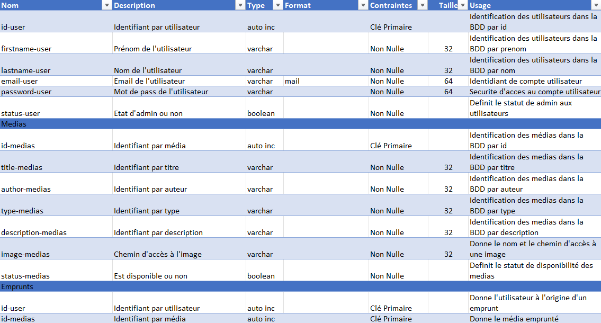
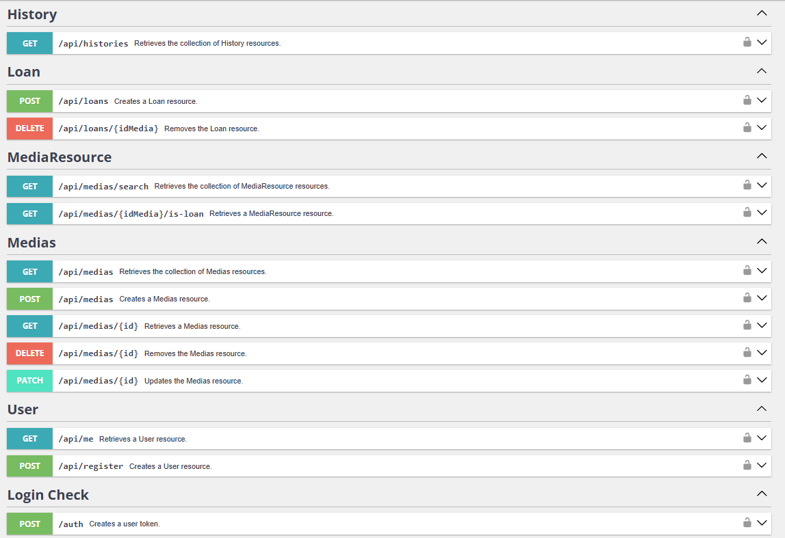

# Rattrapage_web_mediatheque

Le projet vise la réalisation d'une application web permettant la gestion complète d'une médiathèque regroupant des livres, DVD et jeux vidéo. L'application devra disposer d'un Frontend clair et intuitif, un Backend structuré en API REST, et une base de données relationnelle (BDD).

## Installation

**Partie Front-end**
- Installation de Composer et de Twig comme moteur de template.
- Installation d'extensions Snippet HTML, CSS, JS pour la visibilité.
- Installation du live editor pour avoir un aperçu des modifications en direct.

## Configuration

## Organisation

**Style**
- Création d'une maquette Figma :  
  [Lien vers la maquette](https://www.figma.com/proto/i77g0HxKCzoeSqL1fbiiYo/Web-Rattrapage?page-id=0%3A1&node-id=8-51&p=f&viewport=-36%2C201%2C0.1&t=gTSKsJ55MhXWF2Oe-1&scaling=scale-down&content-scaling=fixed&starting-point-node-id=8%3A51)
- Définition d'une charte graphique.
- Utilisation de Bulma.

**Code**

- Le code est architecturé selon le modèle Model-View-Controller, mais sous Symfony, ce qui implique des changements de nom :
    - Les Vues sont dans le dossier `templates`.
    - Les Controllers sont dans `src/Controller` (avec les routes), `src/Repository` (avec des fonctions permettant la manipulation des données) et `src/Entity` (les classes possèdent des méthodes `get` et `set` pour récupérer et modifier les données directement intégrées).
    - Les Models sont définis dans `src/Entity` (Doctrine définit des variables dans les classes qui correspondent aux champs des tables).

(Entity fait le lien avec la BDD, définit ou garde les champs des tables et propose des méthodes pour récupérer les objets associés grâce à Doctrine. Tandis que Repository permet de créer des méthodes personnalisées pour réaliser des requêtes, non pas avec PDO, mais avec Connection.)

- Pour la création de la Base De Données, un dictionnaire, un MCD, un MLD et un MPD ont été réalisés pour définir les besoins et le format de la BDD.
   - Dictionnaire de données :  
     
   - [Modèles de Données (en partant du principe qu'un exemplaire d'un média est unique et que si plusieurs personnes empruntent le même média, ce seront deux médias différents)](imgREADME/Data_Models_mediatheque.pdf)

   - Nous avons donc une BDD avec 4 tables : 
        - `user` contenant les informations des utilisateurs du site.
        - `medias` contenant les informations des médias.
        - `loan` contenant les informations des emprunts réalisés.
        - `history`, qui est une copie de `loan` où l'on ne peut retirer des éléments.

   - Création des tables avec l'ORM Doctrine de Symfony, puis migration sur le serveur MySQL (voir dans `migrations/Version20250427162424.php`).

En partant du principe qu'un administrateur est un utilisateur avec des privilèges, un administrateur se connecte avec son compte comme un utilisateur normal, mais aura des accès supplémentaires. Le statut admin est défini par le booléen `status` de la table `user`.

## Utilisation

**Attention : Les clés secrètes sont écrites ici sans sécurité ! Il faut les retirer en cas de véritable mise en production.**

**La base de données MySQL a été vidée.** Il faut être connecté pour voir son profil, voir ses emprunts ou encore réaliser un emprunt. L'ajout, la modification et la suppression des médias se font avec un compte administrateur. Il n'existe qu'un compte par défaut, et c'est un admin avec les identifiants suivants :

- Email : `admin@cesi.fr`
- Mot de Passe : `4dm1n_p422w0rd`

Les médias déjà empruntés ne sont pas visibles depuis la page d'accueil, mais seront affichés dans la page de recherche ou, si on connaît l'identifiant du média, depuis l'URL `Silmarillion/medias/id`.

La recherche se fait avec la navbar :
- On peut chercher un champ vide pour voir tous les médias.
- On peut entrer un champ pour faire une recherche avancée.
- On peut choisir le format de pagination grâce à la sélection sur la page de recherche.

Utilisation d'une machine virtuelle pour héberger l'API. Code réalisé avec une connexion ssh. Avec API Platform en CLI depuis Symfony, on se connecte à la base de données avec les identifiants. On donne accès à toutes les IP avec un `symfony server:start --allow-all-ip`. Un accès à la documentation est disponible à `/api/`.  

Grâce aux logs sécurisés d'API Platform, la méthode d'authentification permet de générer un token JWT.  
(Logs de test : email : `test@test.fr`, mot de passe : `password`)  
Si aucun JWT n'est fourni dans les requêtes, elles renvoient un message d'erreur.

