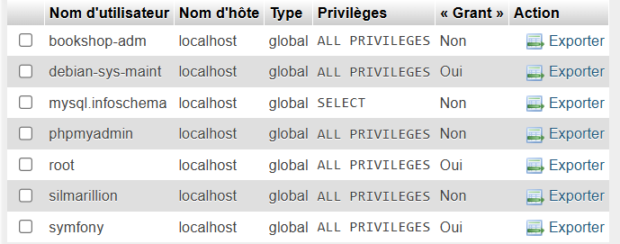

# Rattrapage_web_mediatheque
Le projet vise la réalisation d'une application web permettant la gestion complète d'une médiathèque regroupant des livres, DVD et jeux vidéo. L'application devra disposer d'un Frontend clair et intuitif, un Backend structuré en API REST, et une base de données relationnelle (BDD).

## Erreur
**Si vous n'arrivez pas à accéder à l'application :**
Une vidéo de démonstration est disponible filmée à partir de la release v1.0.2

## Installation

**Partie Back-end**
- Utilisation d'une machine virtuelle sous Ubuntu, avec un accès en SSH
- Installation de Symfony et ses packages (doctrine, tests unitaires, lexik_jwt ...)
- Installation de API Platform

## Configuration

**Hosting**

**PHPmyadmin**
- Creation d'un utilisateur avec des privilèges differents pour plus de sécurité : 

    - Silmarillion : un compte admin avec tous les privilèges et un mdp

**Sécurité**
- Configuration de l'authentification avec le module de sécurité
- JWT pour garantir une connexion pour utiliser certaines methodes
- Routing avec les niveaux de sécurité 

## Organisation

**Style**
- Création d'une maquette Figma 
https://www.figma.com/proto/i77g0HxKCzoeSqL1fbiiYo/Web-Rattrapage?page-id=0%3A1&node-id=8-51&p=f&viewport=-36%2C201%2C0.1&t=gTSKsJ55MhXWF2Oe-1&scaling=scale-down&content-scaling=fixed&starting-point-node-id=8%3A51
- Définition d'une charte graphique
- Utilisation de Bulma

**code**

- Pour la partie back-end, les Entity vont faire le lien avec la bdd, definir ou garder les champs des tables et proposer des methodes pour recuper les objets associés grâce à doctrine. Tandis que Repository va nous permettre de faire nos propres methodes d'objets afin de réaliser des requettes non pas avec PDO mais avec connection
 
- Pour la création de la Base De Données, un dictionnaire, un MCD MLD MPD ont été fait pour définir les besoins et le format de la BDD.
   - Dictionnaire de données : 
   
   - [Modeles de Données (en partant du principe qu'un exemplaire d'un media est unique et que si plusieurs personnes empruntent le meme medias ce seront deux medias différents)](imgREADME/Data_Models_mediatheque.pdf)

   - Nous avons donc une BDD avec 4 tables : 
        - user contenant les informations des utilisateur du site
        - medias contenant les informations des médias
        - loan contenant les informations des emprunts réalises
        - history qui est une copie de loan ou on ne peut retirer des éléments

   - Creation des tables avec l'ORM doctrine de Symfony, puis on migre sur le server mySQL (à voir dans /migrations). 

   - Création des routes avec des méthodes CRUD afin de fournir les informations des champs de la BDD

   - Création de routes ammenant vers des méthodes personnalisées executant des requettes SQL préparées (ex : rechercher, ajouter supprimer un média tout en mettant à jour les autres tables)

En partant du principe qu'un administrateur est un utilisateur avec des privilèges, un administrateur se connecte avec son compte comme un utilisateur normal, mais aura des accès supplémentaires. Le status admin est définit par "ROLE_ADMIN".

## Utilisation

**La base de données MySQL a été vidée**. Il faut être connecté pour voir son profil, consulter ses emprunts ou réaliser un nouvel emprunt. L'ajout, la modification et la suppression des médias nécessitent un compte administrateur. Grâce à l'authentification sécurisée d'API Platform, le système génère un token JWT lors de la connexion. Par défaut, un seul compte administrateur existe avec les identifiants suivants :

- Email : `admin@cesi.fr`
- Mot de Passe : `4dm1n_p422w0rd`

Les médias déjà empruntés ne sont pas visibles depuis la page d'accueil, mais ils apparaissent dans les résultats de recherche ou peuvent être consultés directement via l'URL `Silmarillion/medias/{id}` si vous connaissez leur identifiant.

La recherche s'effectue depuis la barre de navigation :
- Vous pouvez laisser le champ vide pour afficher tous les médias
- Vous pouvez saisir des termes pour effectuer une recherche avancée
- Le format de pagination peut être ajusté via le sélecteur disponible sur la page de recherche

